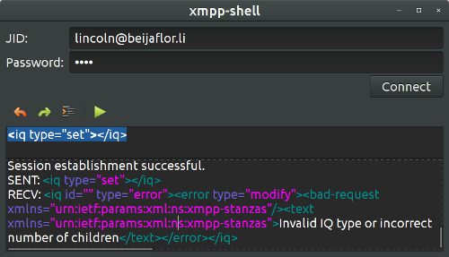

# XMPP Shell

Just a quick hack when I needed to debug some XMPP a while ago. It
depends on Gtk3 and libstrophe and doesn't really provide a lot of
features.

## How it looks like

## Dependencies

`apt-get install libgtksourceview-3.0-dev libgtk-3-dev libstrophe-dev`

## Build & Execute

Run `make` then `./xmpp-shell`
